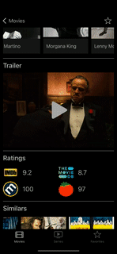

# IMDbViewer_iOS

App for browsing movies and TV Series existing on IMDb.

Developed by using UIKit and MVC architecture.

Data are fetched from IMDb REST API.
CoreData is used for storing user's favorite movies or TV series.

NOTE: In the explanations and illustrations below, movies are generally used. However, all those features are also applicable for TV series.

At the beginning, user can see movies from popular and top 250 categories.

User can search movies from IMDb.

When user taps any movie, app navigates to that movie, and many information is shown about it.

User can also watch trailer of the movie. (Video is displayed in full screen when user rotates the phone.)

User can see information about actors / actresses in the movie by tapping him/her.

User can easily navigate between movies, TV series and actors / actresses.

User can select his/her favorite movies, so that s/he can easily find those movies when opening the app later.

Also, s/he can remove movies from his/her favorite list.

User can replace his/her favorite movies by dragging and dropping.

